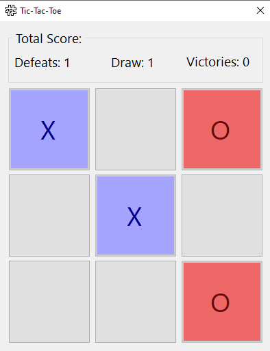

# Invincible Tic-Tac-Toe
This is a tic-tac-toe game developed in C# using the Windows Presentation Foundation (WPF) framework. In this game, you will challenge the machine, which has an unbeatable algorithm capable of predicting possibilities and deciding the best move.

## Layout

* The game board layout

## Rules of Tic-Tac-Toe
Tic-tac-toe is a strategy game for two players, represented by "X" and "O", who take turns marking spaces in a 3x3 grid. The objective of the game is to complete a horizontal, vertical, or diagonal line with your own marks before the opponent. If all spaces are filled and neither player manages to form a line, the game ends in a draw.

## How to Play
* When starting the game, you will be player "X" and make the first move.
* Click on one of the empty spaces to place your mark.
* The machine will make its move immediately after yours, always aiming for the best strategy.
* The game continues until one of the players wins or the game ends in a draw.
* After the game ends, you can restart the match to try to beat the machine again.

## Development Resources Used
* **C#:** Programming language used to implement the game logic.
* **WPF (Windows Presentation Foundation):** Graphical framework used to create the game's user interface (UI), providing a pleasant visual experience.
* **Unbeatable Algorithm:** Implementation of an algorithm that analyzes game possibilities and makes decisions for the machine always aiming for the best strategy, making it practically unbeatable.

## How to Run the Game
* Clone or download this repository to your computer.
* Navigate to the "Versions" folder where you will find executables of the game in its different versions.
* Simply execute the appropriate .exe file for the version you wish to play.
* Enjoy the game against the invincible machine!

## Releases
**V1.0.1**
* First functional version from the game.

**V1.1.0** 
* Fill the labels of victories and draws.
* Change players colors.
* Document the code.
* Change project name.

## Author
- [@thiagoservulo](https://github.com/ThiagoServulo)